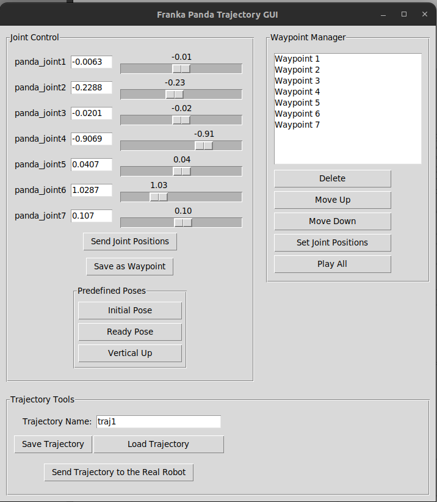
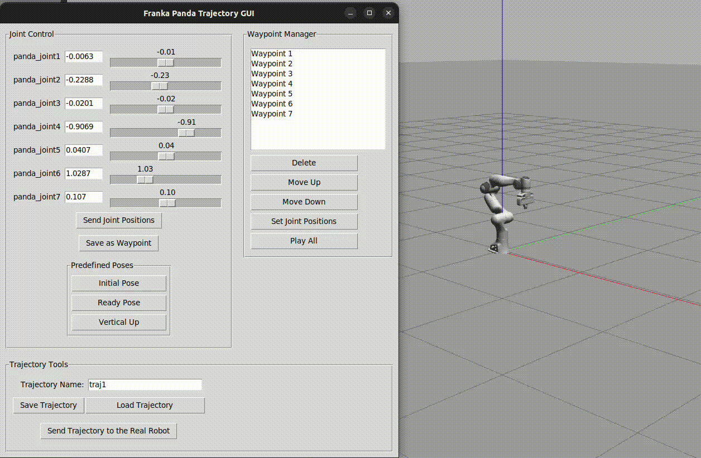

# Panda Trajectory GUI

A Python-based GUI tool for creating, editing, and executing joint-space trajectories on the Franka Emika Panda robot, compatible with both Gazebo simulation and the real robot.

## Features

- Manual joint control with synchronized sliders and text inputs
- Waypoint management: save, reorder, delete, and preview joint positions
- Save and load trajectories as human-readable `.yaml` files
- Play trajectories step-by-step (visual + robot movement)
- Publish full trajectory to `trajectory_controller` for execution
- Launch support for both **simulation** and **real hardware**
- Optional RViz visualization

---

## 🖼 GUI Preview



## 🎬 Demo (GIF)




## Required Simulation Setup

To use this GUI in simulation, you need to install the [panda_simulator](https://github.com/justagist/panda_simulator) packages, which include:

- Gazebo model of the Panda robot
- ROS controllers
- Robot description (URDF/Xacro)

## Installation

1. Clone the repo into your ROS workspace:
    ```bash
    cd ~/catkin_ws/src
    git clone https://github.com/buraksisman/panda_trajectory_gui.git
    ```

2. Make the GUI script executable:
    ```bash
    chmod +x src/panda_trajectory_gui/scripts/panda_trajectory_gui.py
    ```

3. Build the workspace:
    ```bash
    cd ~/catkin_ws
    catkin_make
    source devel/setup.bash
    ```

---

## Launch Instructions

### Run in Simulation Mode (with Gazebo + RViz)
```bash
roslaunch panda_trajectory_gui gui.launch robot:=sim use_rviz:=true
```

### Run on Real Robot (no Gazebo, no RViz)
```bash
roslaunch panda_trajectory_gui gui.launch robot:=real use_rviz:=false
```

---

## YAML Trajectory Format

Saved trajectories look like this:

```yaml
name: pick_and_place
waypoints:
  - [0.0, -0.4, 0.0, -2.0, 0.0, 1.5, 0.5]
  - [0.2, -0.3, 0.2, -1.8, 0.2, 1.3, 0.6]
```

Use the GUI to load, edit, and replay these trajectories easily.

---

## Package Structure

```
panda_trajectory_gui/
├── scripts/
│   └── panda_trajectory_gui.py     # Main GUI node
├── launch/
│   ├── gui.launch                  # Entry-point launcher
│   └── rviz.launch                 # Optional RViz view
├── rviz/
│   └── panda_gui.rviz              # RViz config
├── CMakeLists.txt
└── package.xml
```

---

## ROS Interfaces

### Subscribed Topics
- `/joint_states` (`sensor_msgs/JointState`) – to read current robot configuration

### Published Topics
- `/panda_simulator/motion_controller/arm/joint_commands` (`franka_core_msgs/JointCommand`)
- `/panda_trajectory_gui/follow_joint_trajectory` (`trajectory_msgs/JointTrajectory`)

---

## Dependencies

- Python 3
- `rospy`
- `Tkinter`
- `yaml`
- `franka_core_msgs`
- `trajectory_msgs`
- `robot_state_publisher` and `joint_state_publisher` (optional for RViz)

---

## Author

Burak Sisman — [@buraksisman](https://github.com/buraksisman)  


---

## License

MIT License — free to use, modify, and share.